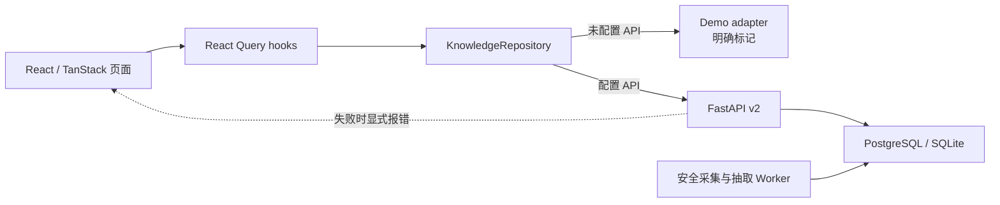
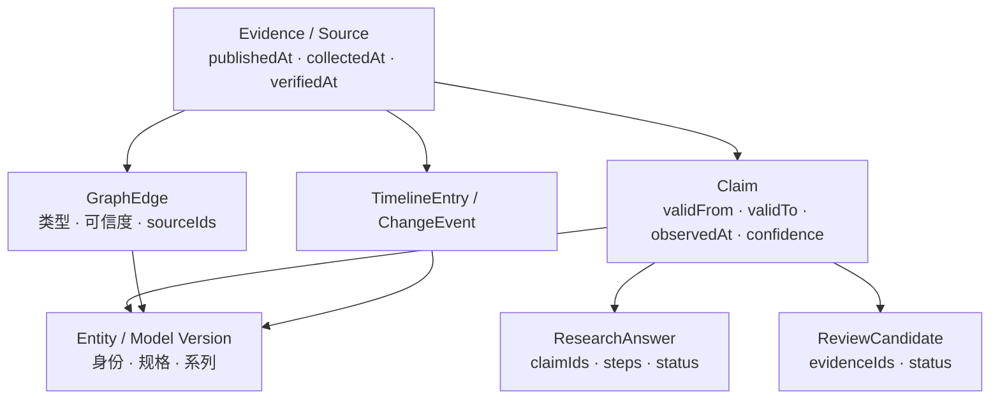
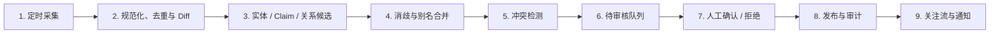

# AI Radar 架构与可信数据闭环

## 系统边界

仓库同时交付 React/TanStack 前端、FastAPI API、SQLAlchemy/Alembic 数据层，以及明确标记的演示数据。前端可以无后端运行作品集模式；配置 `VITE_API_BASE_URL` 后会使用真实 API，失败时显示错误，不会静默退回演示数据。



## 前端分层

```text
src/
├─ domain/                       强类型契约、标签与图算法
├─ data/demo-adapter.ts          明确标记的演示快照
├─ services/
│  ├─ knowledge-repository.ts    Demo / Live 数据边界
│  ├─ admin-api.ts               审核与目录维护 API
│  └─ user-api.ts                登录、关注、通知和研究
├─ hooks/use-knowledge.ts        查询状态与缓存语义
├─ components/
│  ├─ graph/                     SVG 关系查询工具
│  ├─ research/                  逐结论引用与导出
│  └─ pwa-status.tsx             安装、离线和缓存时间
└─ routes/                       文件路由和页面编排
```

## 后端分层

```text
backend/
├─ app/main.py             公共读取、认证用户和管理员 API
├─ app/repository.py       正式目录、审核门禁与公共快照
├─ app/database.py         SQLAlchemy 持久化模型
├─ app/ingestion.py        URL 规范化、快照、哈希去重和 Diff
├─ app/extraction.py       结构化模型抽取适配器
├─ app/quality.py          数据验收与黄金问题
├─ app/engagement.py       关注、通知、摘要和研究
└─ migrations/             可复现的 Alembic 迁移
```

公共目录的 Entity、具体模型版本、关系和时间线存入数据库。首次启动会从版本控制内的种子初始化；管理员之后可通过受保护 API 或 `/admin/review` 增量维护。`familyId` 把具体版本归入顶层模型系列，新增版本不要求改前端。

## 知识与证据模型



关键约束：

- `valid time` 表示事实在现实世界何时有效，`observed time` 表示系统何时发现。
- 已核验关系和时间线必须带来源；没有证据时不能标为 `verified`。
- `verified`、`inferred`、`unverified`、`conflict` 使用文字、图标和线型共同表达。
- 自动采集和模型抽取只生成候选，不能绕过人审直接成为公共 Claim。
- 演示快照始终保留 Demo 标记；Live API 不可用时不伪装为实时数据。

## 数据生产与审核



`/admin/review-demo` 是只读作品集；`/admin/review` 使用 JWT/RBAC，支持审核、采集、摘要、Outbox 和目录扩展。管理员写入会进入审计日志。

## 关系图谱为何存在

图谱是关系查询工具，不是装饰性的 3D 场景：

- 节点表示实体或具体模型版本，边明确标注“属于系列、后继版本、由谁开发、使用什么、参与什么评测”等语义。
- 点击边可查看方向、有效时间、可信度和来源；点击节点可查看一跳/两跳邻域。
- 路径查询回答“两个对象如何发生联系”，时间筛选回答“这段关系在何时成立”。
- 颜色之外还使用形状、文字和线型；明暗主题均使用对应画布和高对比文本。
- 移动端提供列表替代视图。当前不提供 3D，因为 3D 不增加上述查询价值。

## PWA 与离线策略

页面与静态资产可缓存，API 使用网络优先且不写入 Service Worker 数据缓存，避免把过期响应伪装为实时内容。离线时显示状态和最后缓存时间。

## 部署结构

- 本地开发：SQLite + Vite + Uvicorn。
- 在线预发布：Cloudflare Workers 前端 + Render FastAPI 容器 + Neon PostgreSQL + Cloudflare Cron Worker。
- Docker 容器启动前执行 `alembic upgrade head`。
- CI 同时验证 SQLite 与 PostgreSQL 迁移、前端构建、后端测试和种子同步。
- 线上保持 `AI_RADAR_DATA_MODE=demo`，只有正式数据质量门槛通过后才允许切换 `live`。
- SMTP、自定义域名、外部监控和备份恢复演练仍需部署方提供外部资源。

## 关键技术决策

- 公共读取与审核写入分离：公开接口只组合种子和已批准记录，待审、驳回与证据不足内容不会泄漏到公共快照。
- 自动化采用有限吞吐：每周期最多处理有限信源和快照，失败进入退避与冷却，避免供应商故障放大成本。
- 自动批准只覆盖严格锚定的低歧义关系；普通事实仍进入人审，不以数据增长速度换取可信度。
- Cron 使用独立自动化令牌、结构化生命周期日志和有限重试；运维诊断只记录信源 ID，不把 URL 参数、错误正文或凭据写入外部日志。
- 图谱保持二维并提供列表替代视图，因为查询方向、路径、时间与证据比视觉炫技更重要。
