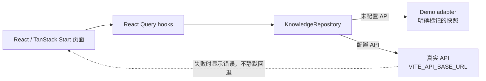
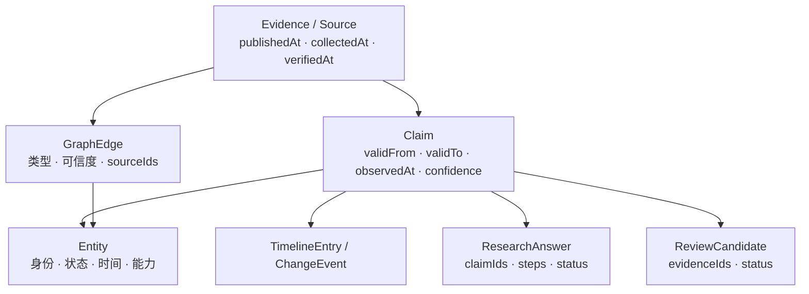
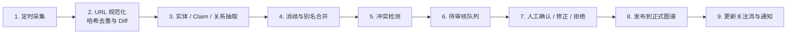
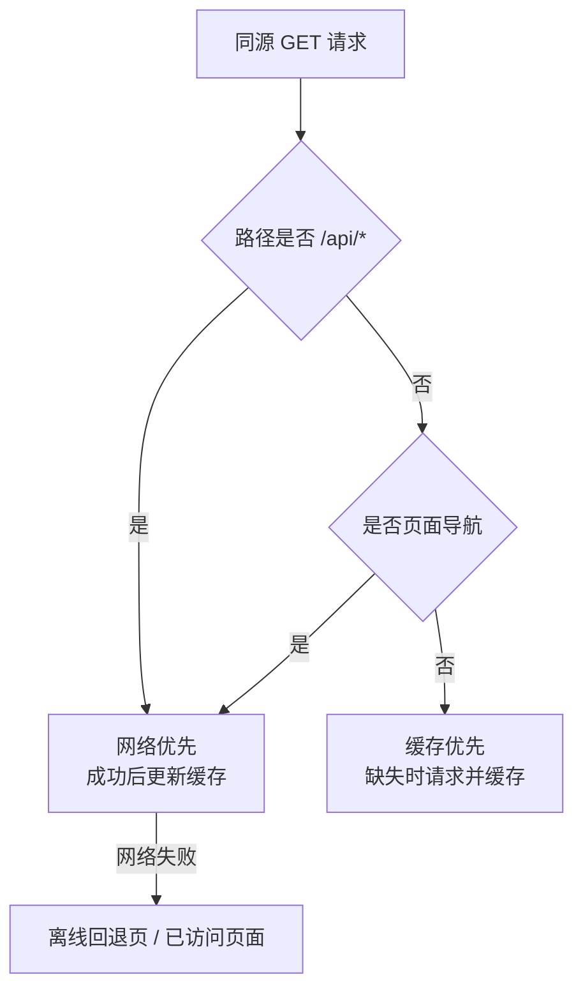

# AI Radar 前端架构与可信数据闭环

## 系统边界

当前仓库交付的是生产化前端与明确标记的演示数据适配层。它验证信息架构、领域契约、证据呈现、交互图谱、研究输出和审核流程，但不伪装已经拥有真实采集、数据库、认证、审核写入或 LLM 服务。



## 前端分层

```text
src/
├─ domain/
│  ├─ types.ts              强类型知识契约
│  ├─ labels.ts             双语领域标签
│  └─ graph.ts              筛选、邻域与最短路径算法
├─ data/
│  └─ demo-adapter.ts       KnowledgeSnapshot 演示适配器
├─ services/
│  └─ knowledge-repository.ts  Demo / Live 数据边界
├─ hooks/
│  └─ use-knowledge.ts      查询状态与缓存语义
├─ components/
│  ├─ graph/                确定性 SVG 图谱与交互
│  ├─ research/             逐结论引用与导出
│  └─ pwa-status.tsx        安装、离线和缓存时间
└─ routes/                  文件路由和页面编排
```

## 知识与证据模型



关键约束：

- `valid time` 表示事实在现实世界何时有效。
- `observed time` 表示系统何时发现或记录事实。
- Claim、关键关系和研究结论必须绑定可访问来源；没有证据时明确显示不足。
- `verified`、`inferred`、`unverified`、`conflict` 在界面中使用文字、图标和线型共同表达，不只依赖颜色。
- 演示快照始终保留 “Demo data” 标记。

## 数据生产与审核



`/admin/review-demo` 只读取 `reviewCandidates`、`syncRuns` 与 `evidence`，不包含写操作。真实后台必须在受保护 API 上实现权限、限流、审计日志和发布记录。

## 2D 图谱

图谱使用轻量确定性 SVG，而不是引入大体积图形依赖：

- 节点类型同时映射颜色和形状。
- 鼠标滚轮 / 按钮缩放，拖动画布平移，拖动节点重排。
- 边按可信度使用实线、虚线、点线和冲突线型。
- 关系类型、可信度、实体类型、时间和 1–2 跳邻域均可筛选。
- 最短路径使用无权 BFS；算法位于 `src/domain/graph.ts` 并有单元测试。
- 节点和边支持键盘选择；移动端提供列表替代视图和底部详情抽屉。

## PWA 与离线策略



API 不进入 Service Worker 缓存，避免把过期数据伪装成实时响应。应用在离线时显示最后在线缓存时间。

## 后续后端接入点

- FastAPI / Pydantic 对齐 `KnowledgeSnapshot` 与细粒度 v2 API。
- PostgreSQL 保存 Entity、Claim、Evidence、Event、ReviewJob 和双时间字段。
- LLM 通过供应商无关适配层输出结构化 JSON，只生成候选，不直接发布。
- 认证后开放关注同步、私密研究、公开发布和审核写操作。
- 定时任务完成 2–6 小时采集、Diff、候选生成与通知。
