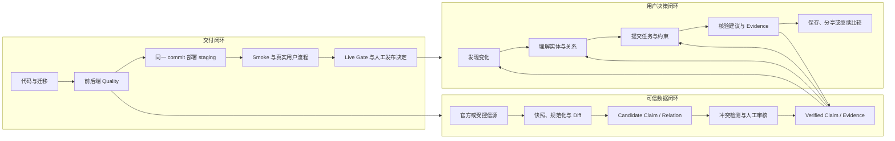
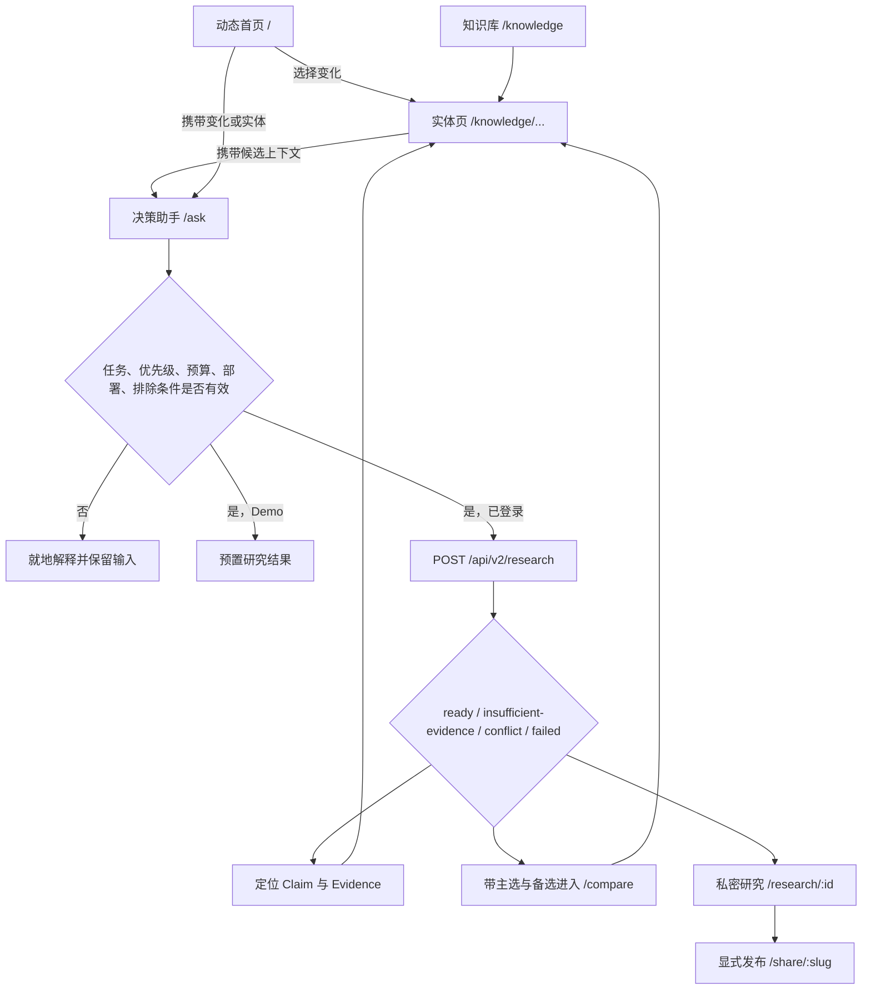
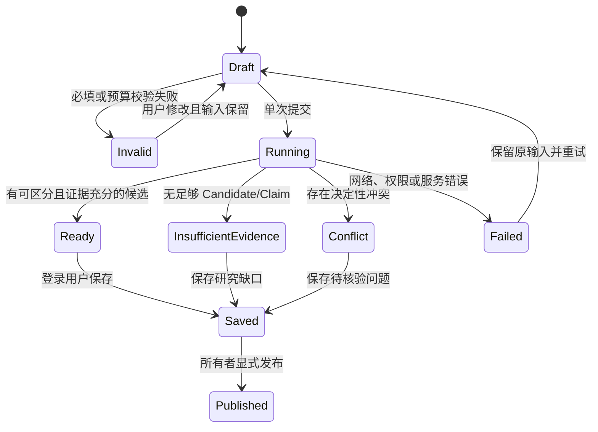
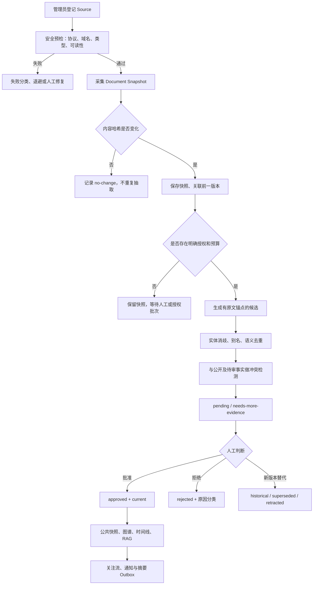
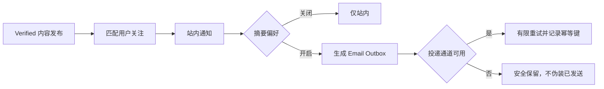
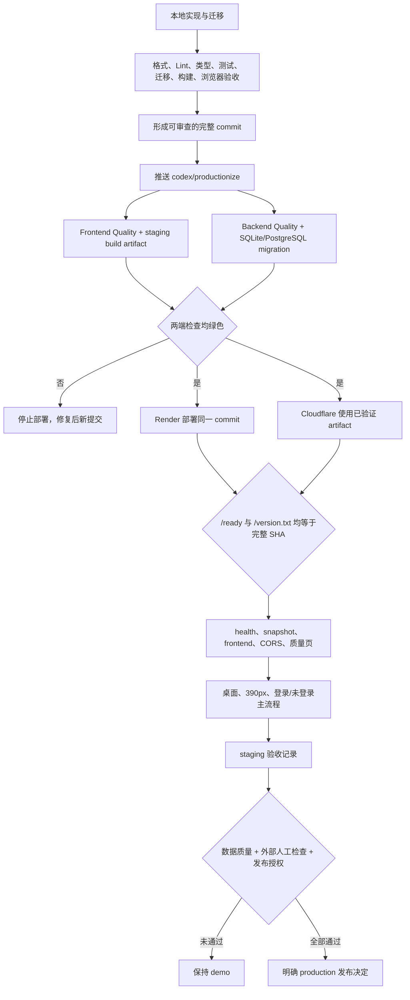

# AI Radar 端到端产品与交付流程

## 文档定位

- 更新时间：2026-09-07
- 性质：项目运行地图，不授予数据写入、模型调用、审核、部署或发布权限
- 产品方向：以 [`../PRODUCT_ROADMAP.md`](../PRODUCT_ROADMAP.md) 为准
- 执行顺序与门禁：以 [`PROJECT_COMPLETION_SPEC.md`](PROJECT_COMPLETION_SPEC.md) 为准
- 系统分层：以 [`ARCHITECTURE.md`](ARCHITECTURE.md) 为准

本文回答五个问题：用户如何完成任务、可信数据如何产生、决策如何绑定证据、代码如何进入 staging、什么条件下才允许进入 live。它把分散在页面、API、数据库、审核后台和 CI 中的真实行为连接为一套可执行的 Operating Model。

## 1. 全局运行模型

AI Radar 不是一个模型排行榜，也不是自动生成资讯的网站。它由三条闭环共同组成：

三条闭环的约束关系：

1. 没有通过审核的 Candidate 不能进入公共知识与决策事实。
2. 没有 Claim ID 和 Evidence 的文本不能伪装成事实性推荐。
3. 没有运行同一完整 commit 的前后端不能声明 staging 验收完成。
4. staging 通过不等于 live；数据质量、外部检查和发布责任仍需单独确认。

## 2. 参与角色与责任边界

| 角色          | 主要任务                               | 可以执行                                             | 不应绕过                                 |
| ------------- | -------------------------------------- | ---------------------------------------------------- | ---------------------------------------- |
| 访客          | 发现变化、阅读实体、体验预置研究       | 读取公开快照、Evidence、质量指标和演示结果           | Demo 标记、证据不足拒答                  |
| 登录用户      | 完成真实决策、保存研究、关注实体       | 创建私密研究、发布自己的分享链接、管理关注和通知偏好 | 他人私密研究、管理员检索诊断             |
| 审核员        | 判断 Candidate 是否可发布              | 批准、拒绝、标记需要更多证据、处理事实生命周期       | Evidence 要求、冲突和并发版本检查        |
| 管理员        | 管理信源、目录、用户和运行诊断         | 采集、抽取、审核、质量检查、审计查询                 | 模型预算、自动批准红线、Secret 边界      |
| 自动化 Worker | 执行有限周期任务                       | 采集到期信源、维护 Outbox 和运行状态                 | 管理员登录、无限模型调用、无审查发布     |
| 发布负责人    | 把验证提交交付到 staging 或 production | 触发受控部署、Smoke、回滚                            | 失败 CI、commit 不一致、未通过 Live Gate |

角色不是具体人员名单。正式发布前必须为管理员、审核员、发布和回滚职责指定真实负责人。

## 3. 用户决策闭环

### 3.1 主路径

### 3.2 页面职责

| 页面                     | 用户问题                         | 必须提供的输出                                      | 下一步                         |
| ------------------------ | -------------------------------- | --------------------------------------------------- | ------------------------------ |
| `/`                      | 最近发生了什么，为什么值得关注   | 变化、影响对象、可信状态、来源入口                  | 实体、Evidence、决策助手       |
| `/knowledge`             | 我要查哪个模型、版本、厂商或概念 | 可搜索、可区分类型的实体入口                        | 实体档案                       |
| `/knowledge/model/:slug` | 这个模型系列目前如何演进         | 当前状态、单一时间线、事实、限制、关系、Evidence    | 决策、Compare、Graph           |
| `/knowledge/:type/:slug` | 这个通用实体与谁相关             | 身份、事实、可读关系、Evidence                      | 决策、完整关系网络             |
| `/ask`                   | 在我的约束下应该先评估谁         | 有条件主选/备选，或明确拒答；条件、取舍、风险、时点 | Claim、Evidence、Compare、保存 |
| `/compare`               | 候选在同一维度和时点有何差异     | 结构化并列信息，未知项保持未知                      | 返回决策或实体                 |
| `/research/:id`          | 如何复查已保存决策               | 原始输入、同一结论、信息时点、发布动作              | Evidence、分享                 |
| `/share/:slug`           | 如何让他人只读核验               | 脱敏决策、Claim 与公开 Evidence                     | 来源核验                       |

### 3.3 决策状态机

决策引擎只对命中的公开 Claim 评分。候选按用户优先级、部署约束以及 `verified`、`inferred`、`conflict` 状态计算；存在决定性冲突时拒绝排名。普通用户看到面向任务的说明，完整 `retrievalDiagnostics` 只对管理员可见。

### 3.4 前后端和数据映射

| 环节       | 前端入口                                      | API / 服务                                     | 持久化                                             |
| ---------- | --------------------------------------------- | ---------------------------------------------- | -------------------------------------------------- |
| 公开知识   | `use-knowledge.ts`、`knowledge-repository.ts` | `/api/v2/snapshot`、`/api/v2/entities...`      | `knowledge_entities`、已批准审核记录、关系和时间线 |
| 创建研究   | `ask.tsx`、`user-api.ts`                      | `POST /api/v2/research`、`engagement.research` | `research_records` 的输入、回答、决策 JSON         |
| 恢复研究   | `research.$id.tsx`                            | `GET /api/v2/research/{id}`                    | 仅所有者可读                                       |
| 发布研究   | `research.$id.tsx`                            | `POST /api/v2/research/{id}/publish`           | `public_slug`、`published_at`                      |
| 公开分享   | `share.$id.tsx`                               | `GET /api/v2/share/{slug}`                     | 重新绑定当前公开 Claim/Evidence，诊断脱敏          |
| 结构化比较 | `compare.tsx`                                 | 公开实体和版本比较接口                         | 不生成新的事实                                     |

## 4. 可信数据闭环

### 4.1 从 Source 到公开知识

### 4.2 审核状态与发布规则

| 状态                  | 含义                         | 是否进入公共快照 | 允许的下一步             |
| --------------------- | ---------------------------- | ---------------- | ------------------------ |
| `pending`             | 候选等待判断                 | 否               | 批准、拒绝、补证据       |
| `needs-more-evidence` | 信息可能有价值但证据不足     | 否               | 增补 Evidence 后重新审核 |
| `approved/current`    | 当前有效且完成审核           | 是               | 维持、被新事实替代、撤回 |
| `approved/historical` | 过去成立，不再是当前事实     | 作为历史事实     | 保留时间口径             |
| `superseded`          | 被明确的新 Claim 替代        | 不再作为当前结论 | 跳转替代 Claim           |
| `retracted`           | 审核后撤回                   | 不作为有效事实   | 保留审计记录             |
| `rejected`            | 不满足真实性、证据或范围要求 | 否               | 保留拒绝原因，不重复生成 |

不可变规则：

- Candidate 与 Verified 数据物理或查询隔离。
- 批准必须存在 Evidence；冲突候选不能使用普通批量批准。
- 自动抽取默认上限为 0，启用时也只生成 Candidate。
- `AI_RADAR_AUTO_APPROVE_GROUNDED_RELATIONS=false`，关系不能自动发布。
- 同一事实的新 Evidence 合并到现有对象，不通过重复 Candidate 增加数量。
- 所有管理员写操作写入 `audit_log`，并使用并发版本防止旧页面覆盖新决定。

### 4.3 关键表和职责

| 表                                             | 职责                                      | 不应承担                       |
| ---------------------------------------------- | ----------------------------------------- | ------------------------------ |
| `sources`                                      | 信源、采集策略、预检和退避状态            | 保存 Secret                    |
| `document_snapshots`                           | 内容快照、哈希、时间与前序快照            | 直接成为公开事实               |
| `ingestion_runs`                               | 记录采集结果和失败分类                    | 替代审计日志                   |
| `review_jobs`                                  | Candidate、Evidence、冲突、审核和生命周期 | 绕过状态直接展示为 Verified    |
| `knowledge_entities`                           | 正式实体目录                              | 存放未经审核的临时实体         |
| `knowledge_relations`                          | 已发布关系                                | 无 Evidence 的推测边           |
| `knowledge_timeline`                           | 已发布变化事件                            | 重复模型页事实列表             |
| `rag_claim_documents` / `rag_claim_embeddings` | 已批准 Claim 的检索投影                   | 成为事实权威源                 |
| `research_records`                             | 用户输入、回答、决策和分享状态            | 保存管理员专用诊断到公开分享   |
| `audit_log`                                    | 管理员动作与关键状态变化                  | 保存 Secret 或完整敏感错误正文 |

## 5. 关注、通知与自动化

当前 staging 使用免费 Render，SMTP 端口受到限制。因此 Outbox 可验证，但真实邮件送达不是当前完成事实；后续应选择 HTTPS 邮件 API 或明确的付费运行环境。

自动化 Worker 使用独立 `AI_RADAR_AUTOMATION_TOKEN`，只调用单周期入口。数据库 advisory lock、周期租约、信源租约和幂等键共同防止重复运行。自动化令牌不能用于登录审核后台。

## 6. 代码到 staging 的交付闭环

### 6.1 门禁证据

| 阶段       | 必须生成的证据                                                                    | 失败处理                   |
| ---------- | --------------------------------------------------------------------------------- | -------------------------- |
| 本地       | `npm run check`、Ruff、pytest、Alembic head/check、`git diff --check`、浏览器记录 | 不提交失败状态             |
| GitHub     | Frontend/Backend jobs 绿色、固定依赖、种子与评估结果无漂移                        | 不启动 staging deploy      |
| 部署一致性 | Render `/ready.buildCommit` 与 Cloudflare `/version.txt` 等于预期 40 位 SHA       | 等待或回滚，不接受部分更新 |
| Smoke      | API ready、公开快照、前端、CORS、质量指标可读                                     | 保持旧版本或回滚           |
| 用户流程   | 发现 → 实体 → 决策 → Evidence；登录研究 → 发布 → 分享                             | 修复后重新走同一提交验收   |
| Live Gate  | 自动阻塞项为 0、`liveReady=true`、外部检查完成、责任人明确                        | 保持 `demo`                |

### 6.2 环境边界

| 环境       | 数据与目的                                      | 允许声明                 |
| ---------- | ----------------------------------------------- | ------------------------ |
| 本地       | SQLite 或临时 PostgreSQL；开发与自动化验证      | 本地门禁通过             |
| staging    | Cloudflare Workers + Render + Neon，保持 `demo` | 指定 commit 的预发布验收 |
| production | 尚未定义独立分支、服务、域名和责任体系          | 当前不可声明正式上线     |

## 7. 异常与恢复路径

| 异常                  | 用户或运维看到什么                            | 恢复动作                             |
| --------------------- | --------------------------------------------- | ------------------------------------ |
| Live API 不可用       | 明确错误或演示模式，不静默伪装实时数据        | 保留用户输入，重试只读请求或稍后恢复 |
| Evidence 不足         | `insufficient-evidence`、未知范围和下一步核验 | 补充约束或进入受控内容审核流程       |
| 决定性冲突            | `conflict`，不返回确定排名                    | 人工核验冲突来源与有效时间           |
| 登录过期              | 清除旧会话并返回登录状态                      | 重新登录，不自动重放写请求           |
| 信源采集失败          | 失败分类、计数、退避时间和可操作说明          | 修复 URL/策略后显式 retry 或等待冷却 |
| 模型或 Embedding 失败 | 有限重试；检索安全降级为 lexical              | 检查额度/凭据，不放宽真实性门槛      |
| 审核并发冲突          | 409，不覆盖较新的决定                         | 刷新队列后重新判断                   |
| 前后端 commit 不一致  | staging release gate 失败                     | 等待同一 SHA 或回滚到上一已验收 SHA  |
| 邮件通道不可用        | Outbox 保留，不显示已送达                     | 配置 HTTPS 投递通道后幂等重试        |

## 8. 当前落地状态

截至 2026-09-07，本地工作树已经具备：

- 三入口信息架构、单一模型时间线、三种阅读模式和上下文决策入口。
- 结构化决策输入、证据绑定输出、冲突/证据不足拒答、研究恢复与分享脱敏。
- Core Model manifest 和可复现覆盖报告。
- 前后端 CI 分离、固定 Wrangler、检查通过后部署和双端 commit 等待逻辑。
- 本地前端完整门禁、后端测试和 SQLite 空库迁移验证。
- 桌面与 390px 决策助手浏览器验收、Evidence 锚点和无控制台错误记录。

尚未完成的是外部闭环：

1. 当前混合工作树尚未整理成可审查提交并推送。
2. GitHub 尚未针对新提交生成绿色检查。
3. Render 与 Cloudflare 尚未运行同一新提交并完成 smoke。
4. 部署环境尚未重新确认普通自动抽取上限为 0。
5. 32 个开放审核项、1 个关系 Candidate 和真实内容缺口仍需人工证据判断。
6. 数据质量仍未达到 Live Gate，production 环境与责任体系尚未定义。

## 9. 下一阶段执行顺序

以下顺序保持 `PROJECT_COMPLETION_SPEC.md` 的 Node 0 → 6 约束：

1. **整理提交边界**：区分本次产品闭环代码、历史文档删除和本地个人文件；生成有限、可审查的 commit。
2. **触发 Quality**：推送后等待前后端检查，失败则只修复失败项并追加提交。
3. **验收同一 commit 的 staging**：等待 Render 和 Cloudflare 都报告完整 SHA，再运行 smoke。
4. **只读核验运营状态**：读取集成开关、质量报告、审核库存和关系批次；不自动批准、不调用新模型。
5. **人工处理证据工作**：对开放 Candidate 和 Core Model 内容缺口逐项决定，未找到可靠 Evidence 的保持缺口。
6. **完成目标用户验证**：使用 5–10 个真实任务记录完成率、证据可达性、误解点和拒答质量。
7. **定义 production**：明确分支、服务、域名、数据库、Secret、监控、备份、发布和回滚负责人。
8. **召开发布判断**：机器门禁和人工检查同时通过后，用户再明确决定保持 Demo、接受 staging 或进入 live。

## 10. 局部 Comp-first 设计范围

工程主线继续 code-first；只对直接影响北极星任务的三个界面先做体验方案，再形成差异 Spec：

| 界面     | 设计目标                                   | 重点验证                              | 不扩大的范围                  |
| -------- | ------------------------------------------ | ------------------------------------- | ----------------------------- |
| 首页     | 30 秒内理解“变化、可信证据、决策”          | 用户能说清产品价值并进入一条变化      | 不重做全部品牌系统            |
| 决策助手 | 用最少认知负担表达约束、建议条件和未知     | 完整提交率、拒答理解、两步到 Evidence | 不引入无证据聊天生成          |
| 模型详情 | 把当前状态、变化、关系和证据组织为连续阅读 | 三种模式差异、关系可读、决策入口连续  | 不增加第二套时间线或装饰性 3D |

每个 Comp 只能产生三类后续任务：改善任务完成率、降低事实误解、缩短 Evidence 核验路径。仅改变视觉风格但不影响这三项的内容，不进入当前收尾范围。

## 11. 项目完成定义

项目不是在“代码已经写完”时完成，而是在以下事实同时成立时完成：

- 用户能完成发现、理解、决策、核验、保存或分享的主任务。
- 所有事实性决策输出都能回到公开 Claim 和 Evidence。
- Candidate、冲突、历史事实与当前事实不会混入同一可信状态。
- 自动化受到来源、预算、并发、重试和人工审核边界约束。
- 本地、CI、Render 和 Cloudflare 对应同一可回滚 commit。
- staging Smoke 和真实用户流程通过；失败路径提供恢复动作。
- Live Gate 与外部人工检查通过，并有明确 production 责任人。

在这些条件未同时满足前，最准确的状态是“本地产品闭环已实现，staging 与 live 外部闭环待完成”。
