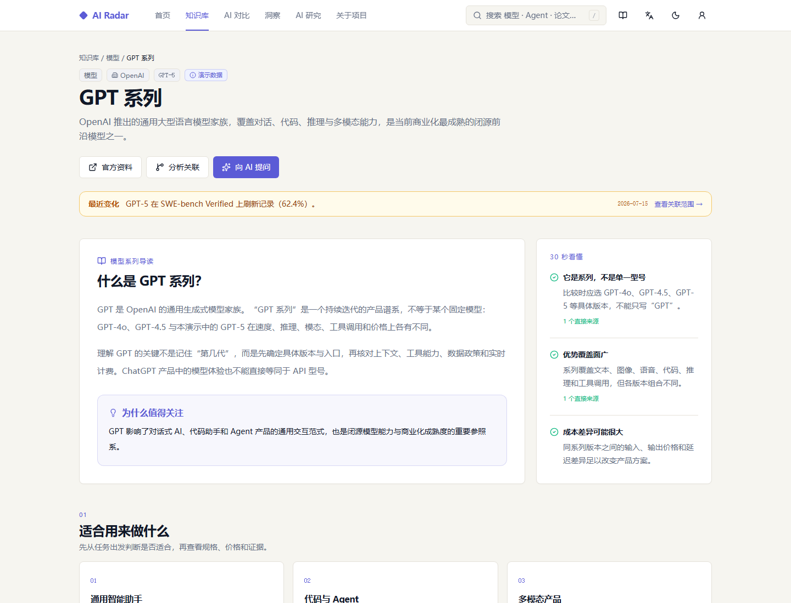
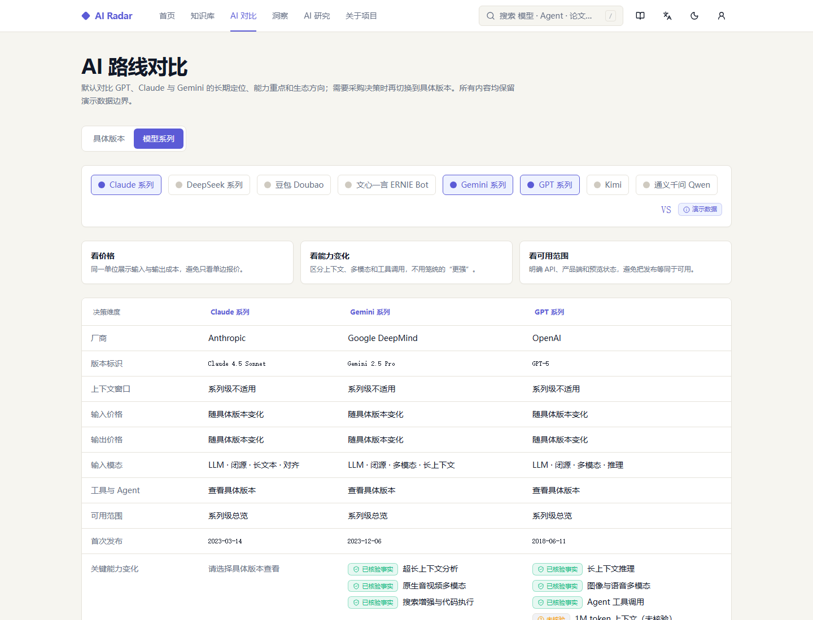
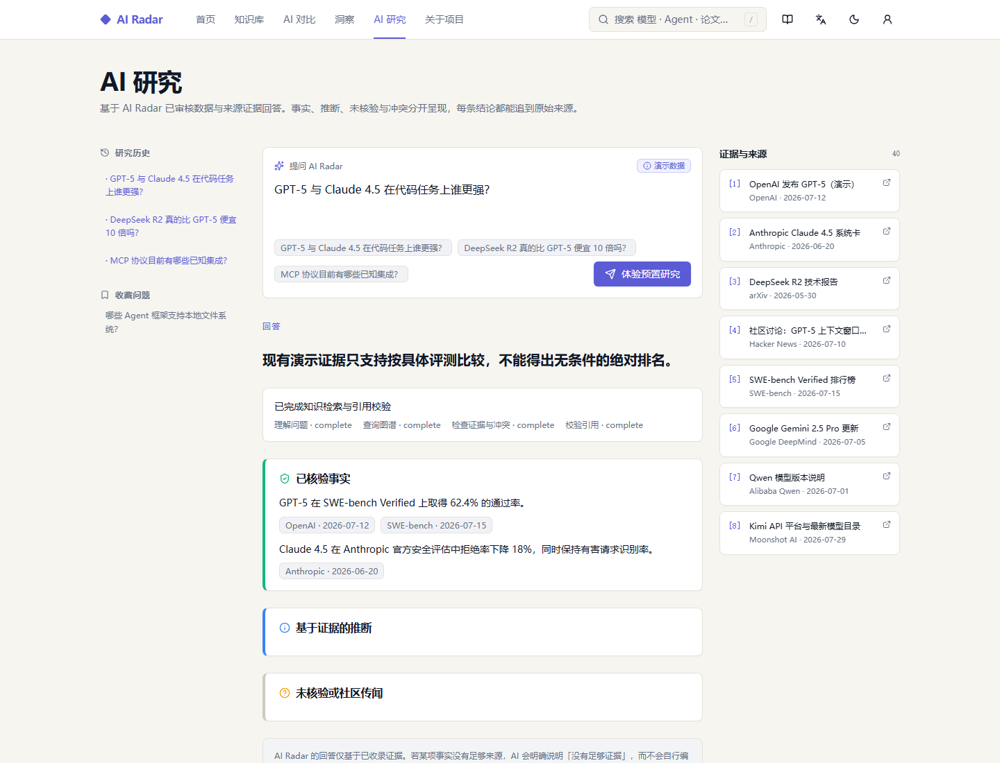
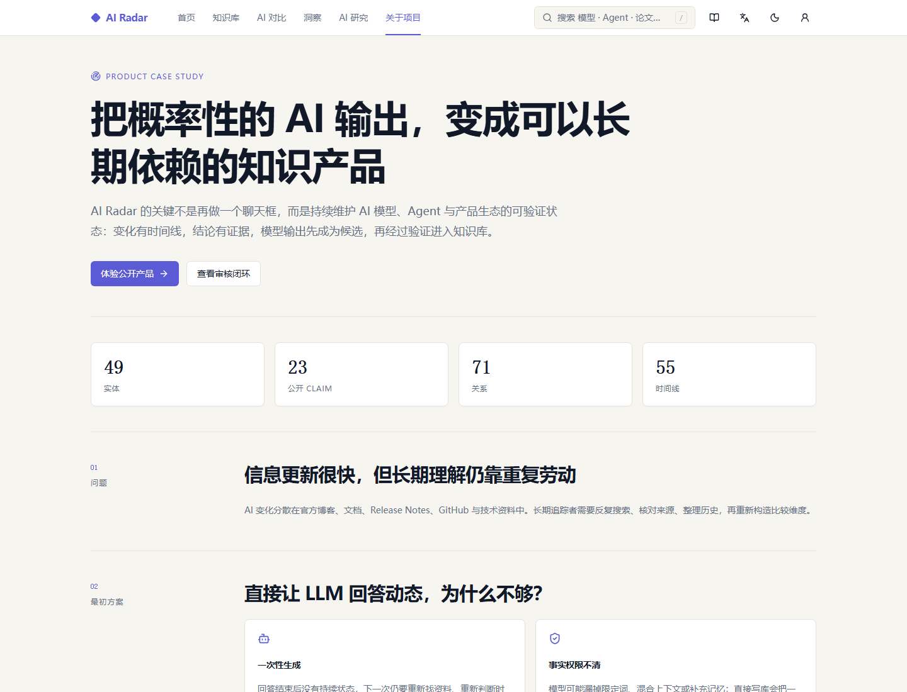

# AI Radar 作品集验收与截图

验收日期：2026-08-21。验收对象为公开预发布地址 <https://ai-radar-staging.1966761779.workers.dev>。

## 验收结果

| 范围 | 结果 | 证据 |
| --- | --- | --- |
| 桌面首页 | 通过 | 产品价值、Trust Layer、Demo 边界、变化卡和三条核心路径正常显示 |
| 模型 Timeline | 通过 | GPT 系列导读、最新变化、来源入口与关系分析入口正常显示 |
| AI 路线对比 | 通过 | 默认比较 GPT、Claude、Gemini 三个系列，系列与具体版本边界明确 |
| 证据研究 | 通过 | 未登录即可体验预置研究，事实、推断、未核验内容和来源分层显示 |
| Case Study | 通过 | 问题、方案转向、产品决策、真实指标与 Showcase / Live 边界完整展示 |
| 桌面图谱 | 通过 | 三种关系任务、分析对象、覆盖指标和关系证据正常显示 |
| 移动图谱 | 通过 | 390×844 视口无页面级横向滚动，底部导航未遮挡主任务卡 |
| 登录边界 | 通过 | 未登录访问 `/account` 时显示邮箱、密码和登录操作，不伪造账户状态 |
| 只读审核后台 | 通过 | 权限边界、数据生产闭环、来源统计和空审核队列正常显示 |
| 异常状态 | 通过 | 不存在的公开研究记录显示明确失败状态，没有回退为演示答案 |
| 工程门禁 | 通过 | 前端 68 项测试、类型检查、Lint、生产与 staging 构建通过；后端 107 项测试、Ruff、编译与 SQLite 迁移通过；GitHub CI 已完成 PostgreSQL 迁移验证 |
| 线上冒烟 | 通过 | 首页、公开快照代理、Timeline、Compare、Research、Case Study、只读审核页均返回 200，HTML 无错误边界 |

## 桌面首页

## 模型 Timeline

## AI 路线对比

## 证据研究

## 产品 Case Study

## 桌面关系图谱

## 移动关系图谱

## 登录账户

## 只读审核后台

## 异常状态

## 仍需人工完成的外部验收

- 使用现有管理员账号完成一次线上 JWT 登录和真实审核后台浏览；本次自动验收不读取账号密码或浏览器会话。
- 接通 SMTP 后验证实际投递、退信和发件域。
- 配置自定义域后验证 DNS、证书和跨域策略。
- 配置外部监控与告警接收人，并完成 Neon 备份恢复演练。
